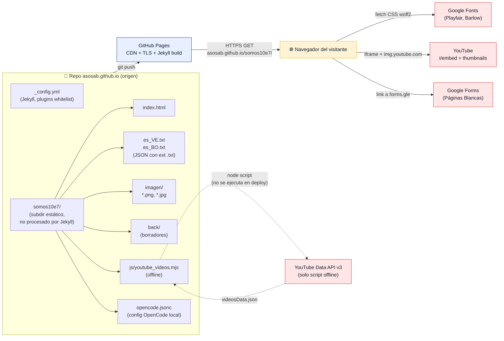
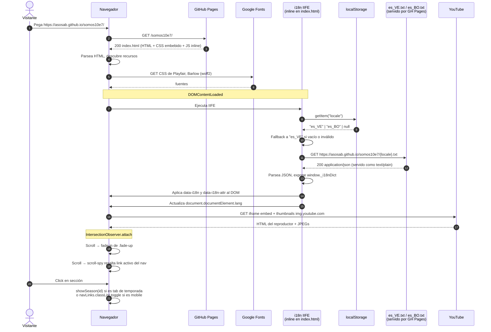
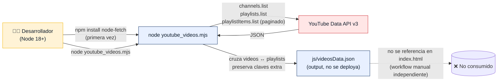

# Arquitectura — Somos 10⁷ Landing

Diagrama de la landing page estática en `somos10e7/`. La aplicación es un
sitio HTML/CSS/JS puro, sin build, sin backend propio, servido por GitHub
Pages. Todo el "runtime" ocurre en el navegador del visitante.

---

## 1. Vista de despliegue y servicios externos

**Notas:**
- El repo raíz usa Jekyll (`_config.yml`), pero `somos10e7/` es un
  subdirectorio sin front matter: GitHub Pages lo sirve **tal cual**.
- `back/` y `opencode.jsonc` no se sirven en producción: están en
  `.gitignore` lógico (no se listan en el HTML generado) y no se
  referencian desde la página.
- El script `youtube_videos.mjs` no forma parte del runtime; es una
  utilidad local para regenerar `videosData.json`, que **no se consume**
  por la landing.

---

## 2. Flujo de carga de la página (runtime del visitante)

**Puntos críticos del flujo:**

1. El **fetch del locale** es no bloqueante: el HTML ya muestra textos
   por defecto; el JS los reemplaza cuando llega el JSON.
2. La URL del i18n es **absoluta** (`https://asosab.github.io/somos10e7/`).
   Cambiar el path del directorio rompe el fetch.
3. `.txt` se sirve con `Content-Type: text/plain`; el JS hace
   `r => r.json()` igualmente porque el cuerpo es JSON válido.
4. La persistencia del locale es **solo cliente** (`localStorage`).
   No hay sesión, no hay cookie, no hay backend.

---

## 3. Componentes dentro de `index.html`

```mermaid
flowchart TB
    subgraph HEAD["&lt;head&gt;"]
        META["Meta SEO + Open Graph + Twitter Card"]
        JSONLD["JSON-LD Schema.org<br/>PodcastSeries"]
        FONTS["&lt;link&gt; Google Fonts"]
        CSS["&lt;style&gt;<br/>Variables, layout, animaciones<br/>(~1000 líneas embebidas)"]
        I18N["&lt;script&gt; i18n IIFE"]
    end

    subgraph BODY["&lt;body&gt;"]
        NAV["#navbar<br/>nav fijo + mobile toggle"]
        HERO["#hero<br/>título + CTAs + anillos orbitales"]
        ULT["#ultimo<br/>iframe del último episodio"]
        TEMP["#temporadas<br/>tabs por temporada +<br/>grid de episode-cards"]
        ENT["#entrevistas<br/>grid de entrevista-cards"]
        MIC["#micros<br/>(placeholder, vacío)"]
        EQ["#equipo<br/>4 cards del equipo"]
        RED["#redes<br/>8 plataformas"]
        PB["#paginas-blancas<br/>CTA a Google Forms"]
        FOOT["footer<br/>secciones + contacto"]
    end

    subgraph SCRIPTS["&lt;script&gt; al final del body"]
        NAVJS["navToggle handler"]
        SEAS["showSeason(id, btn)"]
        IO["IntersectionObserver<br/>fade-in + scroll-spy"]
    end

    I18N -. "lee/escribe" .-> LS2[("localStorage<br/>key='locale'")]
    I18N -. "fetch" .-> LOC2["{locale}.txt"]
    TEMP --> SEAS
    NAV --> NAVJS
    BODY --> IO
    CSS -. "anima" .-> IO

    classDef head fill:#1A3A6B,stroke:#0D1B2A,color:#FAF5E9
    classDef body fill:#FAF5E9,stroke:#0D1B2A,color:#0D1B2A
    classDef js fill:#F4B400,stroke:#0D1B2A,color:#0D1B2A
    class HEAD head
    class BODY body
    class SCRIPTS js
```

**Observaciones:**

- `#micros` está declarado en el nav y en el footer pero la sección
  está vacía (placeholder) en el HTML actual.
- No hay bundler ni módulo ES: todo el JS es `<script>` clásico en orden
  de ejecución (i18n en `<head>`, handlers al final del `<body>`).
- El CSS está **embebido en `<style>`**, no en `assets/`. Para
  temas/variables hay que editar el bloque `:root` dentro de `index.html`.

---

## 4. Pipeline offline: regenerar `videosData.json`

**Por qué este pipeline existe pero no se usa:**

El script podría listar todos los videos del canal `@somos10e7`, pero
los episodios visibles en la landing se **editan a mano** dentro de
`index.html` (orden, títulos traducidos, portadas personalizadas). El
JSON queda en disco solo como referencia editorial.

---

## Resumen de límites del sistema

| Frontera            | Adentro                              | Afuera                                |
| ------------------- | ------------------------------------ | ------------------------------------- |
| **Build**           | Nada (HTML/CSS/JS estático)          | Jekyll (solo en el resto del repo)    |
| **Runtime**         | Navegador del visitante              | GitHub Pages (solo hosting)            |
| **Estado**          | `localStorage.locale`                | Cookies, sesión, base de datos        |
| **Datos dinámicos** | YouTube embeds, Google Forms         | Backend propio (no existe)            |
| **Configuración**   | `opencode.jsonc` (solo OpenCode)     | Variables de entorno, secretos        |
| **Secretos**        | `API_KEY` de YT, `CONTEXT7_API_KEY`  | ⚠️ Commiteados en el repo             |
